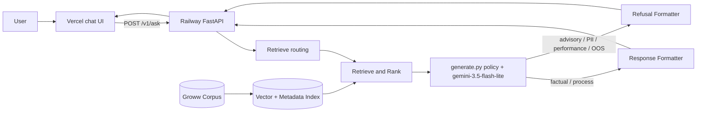
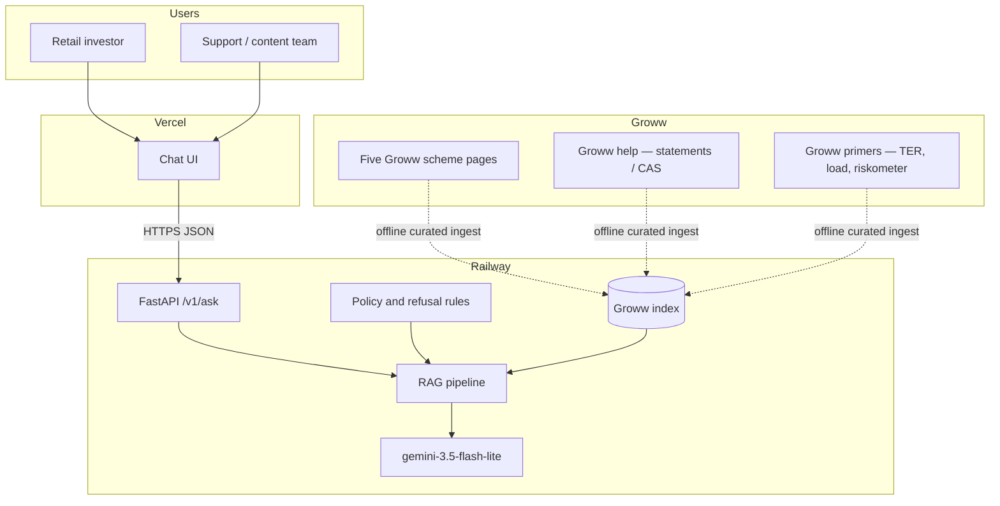
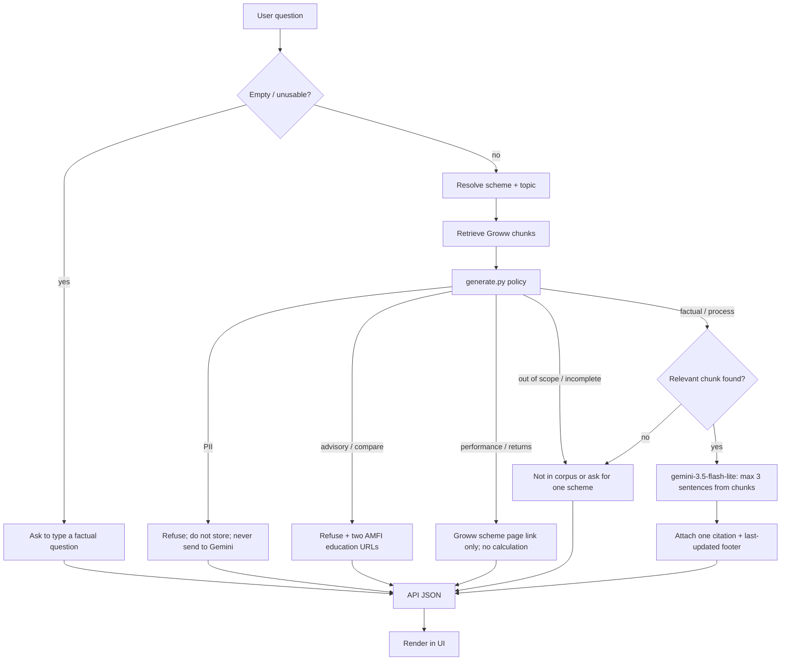
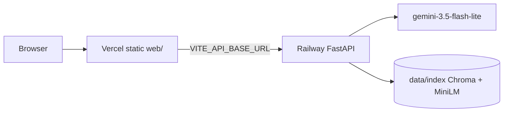

# Architecture: Mutual Fund FAQ Assistant

This document describes the system architecture for the facts-only mutual fund FAQ assistant defined in [ProblemStatement.md](ProblemStatement.md). The design is intentionally lightweight: retrieve from a curated **Groww** corpus, answer only what those Groww pages support, and refuse everything else.

The runtime is split: a **FastAPI** service on **Railway** owns the index, policy, and Gemini; a **Vite + React** page on **Vercel** is the chat UI. Local work follows the same split (Uvicorn + `web/` dev server) before deploy. See [implementation-plan.md](implementation-plan.md) Phases 6–8.

## 1. Design Principles

| Principle | Implication |
| --- | --- |
| Accuracy over intelligence | Prefer a short sourced answer over a fluent but unverified one. |
| Groww sources only | Index the five Groww scheme pages plus Groww help / primer pages. Do not retrieve from AMC sites. |
| Facts, never advice | Advisory, comparative, and performance-calculation queries are refused or redirected. |
| Verifiable answers | Every factual reply has exactly one citation and a last-updated footer. |
| Privacy by design | The app never collects PAN, Aadhaar, account numbers, OTPs, email, or phone. |
| Minimal surface | One chat screen: welcome, three example questions, and a fixed disclaimer. |
| Split deploy | Browser talks only to the FAQ API. Gemini and the index stay on the backend. |

## 2. High-Level Architecture



The assistant is a **two-process** RAG application: a static chat page (Vercel) and a Python API (Railway) that owns retrieve, policy, and Gemini. Chat retrieval and answer writing use **Gemini 3.5 Flash-Lite** (`gemini-3.5-flash-lite`). The model does not browse or invent scheme facts; it only reads the Groww chunks returned by the index.

1. The UI accepts a free-text question and `POST`s it to `/v1/ask`.
2. **Retrieve routing** (`src/guard.py`) labels `scheme_id` and topic. It does not refuse policy.
3. Retrieval runs on the Groww index that ships with (or is built on) the API host.
4. **`src/generate.py`** refuses PII, return math, listed out-of-scope, and incomplete in code (identifiers never reach Gemini). Advice, ranking, and “best scheme” (any wording) are **not** a phrase list in `guard.py`; they are judged by `llm_system_prompt()` when Gemini is called. If the model writes an advice refusal, the AMFI copy is pinned.
5. For allowed factual / process questions, `gemini-3.5-flash-lite` writes at most three sentences from those chunks.
6. A formatter attaches exactly one Groww citation and the last-updated footer.
7. The API returns JSON (`text`, `intent`, `scheme_id`, `topic`, `source_url`, `as_of_date`, `pii_blocked`). The UI renders `text` and does not keep PII-flagged user input.

No user identity, session account, or personal financial data is stored. PII-flagged text is never sent to Gemini and is not written to Railway logs or Vercel analytics as the raw query.

## 3. System Context



The problem statement lists five **Groww** scheme URLs. Those pages — not AMC sites — are the in-scope corpus.

## 4. In-Scope Groww Schemes

Product: **Groww**. Scheme IDs match the Groww URL slugs.

| Groww page | Category | Source |
| --- | --- | --- |
| Mid Cap Fund Direct Growth | Mid-cap | https://groww.in/mutual-funds/hdfc-mid-cap-fund-direct-growth |
| Small Cap Fund Direct Growth | Small-cap | https://groww.in/mutual-funds/hdfc-small-cap-fund-direct-growth |
| Gold ETF Fund of Fund Direct Plan Growth | Gold / FoF | https://groww.in/mutual-funds/hdfc-gold-etf-fund-of-fund-direct-plan-growth |
| Large Cap Fund Direct Growth | Large-cap | https://groww.in/mutual-funds/hdfc-large-cap-fund-direct-growth |
| ELSS Tax Saver Fund Direct Plan Growth | ELSS | https://groww.in/mutual-funds/hdfc-elss-tax-saver-fund-direct-plan-growth |

Allowed factual topics per scheme (or process, where noted):

- Expense ratio
- Exit load
- Minimum SIP amount
- ELSS lock-in period (ELSS scheme only)
- Riskometer classification
- Benchmark index
- How to download statements or capital-gains reports (Groww help)

## 5. Component Design

### 5.1 HTTP API (`api/main.py`)

The only public backend. It wraps `src/pipeline.py.handle`. It does not add a second policy engine.

| Method | Path | Role |
| --- | --- | --- |
| `GET` | `/health` | Liveness. `{ "ok": true, "index_ready": true }` when Chroma can be opened. |
| `POST` | `/v1/ask` | One question in, one formatted answer out. |

Request body: `{ "query": "<string>" }`. Optional `{ "extractive": true }` skips Gemini (tests / fallback).

Response (`200`): `text`, `intent`, `scheme_id`, `topic`, `source_url`, `as_of_date`, `pii_blocked`. The raw query is not echoed.

| Condition | HTTP | Notes |
| --- | --- | --- |
| Empty / unusable query | `400` | Incomplete-empty copy. No Gemini. |
| Index missing or unreadable | `503` | Corpus unavailable. No Gemini. |
| Factual, process, advisory, performance, OOS, PII | `200` | Client always reads `text`. `pii_blocked` is true only for PII. |

CORS is an allowlist (`FRONTEND_ORIGINS`): local Vite origins during Phase 7, the Vercel origin in production. The Gemini key is read from the API process environment only.

### 5.1.1 Minimal Chat UI (`web/`)

A single page hosted on Vercel (or Vite dev server locally) with:

- Welcome message describing the facts-only Groww FAQ scope
- Three clickable example questions (for example: expense ratio, exit load, SIP minimum)
- Persistent disclaimer: **Facts-only. No investment advice.**
- Chat transcript (ephemeral, **browser** memory only)
- Text input with no identity fields

The UI never asks for, displays, or stores personal identifiers. Local `npm run dev` calls `POST /v1/ask` on the Vite origin (proxy to the local API). Production uses `VITE_API_BASE_URL` (Railway). On `pii_blocked`, it shows the refusal and does not append the user text to the transcript. It does not embed, retrieve, or call Gemini.

### 5.2 Retrieve routing (`src/guard.py`)

Labels the question for search. It is not the policy layer. Empty / unusable input is the only front-door stop. Every other label is allowed through to retrieve.

| Intent | Examples | Routing |
| --- | --- | --- |
| `factual` | “What is the exit load of HDFC Large Cap Fund Direct Growth?” | Filter by `scheme_id` + topic |
| `catalog` | “Show exit loads of all schemes in a table” | One retrieve per in-scope scheme; table, not a 3-sentence cap |
| `process` | “How do I download a capital gains report?” | Filter `generic` Groww help |
| `performance` | “What was the 3-year return?” | May retrieve; code refuses calculation |
| `incomplete` | Topic without a scheme | May retrieve; code asks for the missing piece |
| `out_of_scope` | Other AMCs, news, tax planning, portfolio construction, or **unlabelled** questions | Listed OOS is refused in code. Unlabelled questions (`unknown`, scheme with no topic, two schemes) go to Gemini so the **system prompt** can refuse advice/compare. |

`guard.py` does **not** label `advisory` with regex. Advice, ranking, and “say me a best scheme” look like `unknown` / `topic_required` / `multiple_schemes` until Gemini applies the prompt. The API `intent` becomes `advisory` when the writer returns the AMFI refusal.

PII is **not** an intent here. A PAN-shaped token does not change the retrieve label. Identifiers are refused only in `src/generate.py`.

### 5.2.1 Gemini-side policy (`src/generate.py`)

Refusals at the Gemini call site:

1. `policy_block_for_gemini()` — PII first (never send identifiers), then **performance**, **listed** out of scope, and **incomplete** (missing topic/scheme copy). Advisory is **not** blocked here.
2. `llm_system_prompt()` — advice, ranking, comparison, and “best scheme” (any wording, including broken English). Gemini must reply with the AMFI refusal, not the Groww “not on these pages” copy.
3. Catalog tables still run after a Gemini screen so “compare all schemes” cannot become a ranking table.

Priority: `PII` > `advisory` / compare (prompt) > `performance` > `out_of_scope` > `incomplete` > `catalog` > `process` / `factual`.

PII detection uses pattern checks (PAN / Aadhaar / account-like digits / OTP / email / phone). Matching text is not written to logs or history and is not sent to Gemini.

### 5.3 Groww Corpus and Index

**Ingest (offline, curated):**

1. Download the five Groww scheme pages listed in the problem statement.
2. Add Groww help pages for statements / capital-gains / CAS / ELSS reports, and Groww primers for expense ratio, exit load, and riskometer.
3. Extract text, chunk, and attach metadata. Do not ingest hdfcfund.com or other non-Groww hosts.

**Chunk metadata (required):**

| Field | Purpose |
| --- | --- |
| `scheme_id` | Which of the five schemes this chunk belongs to, or `generic` |
| `doc_type` | `groww_scheme` / `groww_help` |
| `source_url` | Groww citation URL |
| `source_title` | Human-readable document name |
| `as_of_date` | Document or page last-updated date |
| `topic_tags` | `expense_ratio`, `exit_load`, `sip`, `lock_in`, `riskometer`, `benchmark`, `statements` |

**Index:** a local vector store plus metadata filters. Retrieval is hybrid when useful:

- Semantic search over embeddings for phrasing variation
- Metadata filter by `scheme_id` and `topic_tags` when the query names a scheme or topic

AMC sites, Moneycontrol, Value Research, and other non-Groww hosts are excluded from ingest.

### 5.4 Retrieve and Rank

1. Resolve scheme (one of five) and topic from the query.
2. Filter the index by `scheme_id` (and `generic` for process questions).
3. Retrieve top-k chunks (small k, typically 3–5).
4. Drop chunks whose `source_url` is missing or not on `groww.in`.
5. If nothing relevant remains, return a “not in corpus” refusal rather than guessing.

### 5.5 Constrained Generator (`gemini-3.5-flash-lite`)

Chat retrieval uses **Gemini 3.5 Flash-Lite** via the Gemini API. The model is chosen for low latency and short, document-grounded answers — not for open-ended financial reasoning.

| Setting | Value |
| --- | --- |
| Model ID | `gemini-3.5-flash-lite` |
| Role | Policy boundary + grounded FAQ writer after retrieval |
| Inputs | System policy (full guard rules) + user question + retrieved Groww chunks (text only) |
| Output | At most three factual sentences; no citation URL invented by the model |
| Source of truth | Retrieved chunks and `corpus_manifest.json`, not Gemini parametric knowledge |

The model may use **only** the retrieved chunks. System rules:

- Answer in at most **three sentences**
- State facts present in the chunks; do not infer advice or compute returns
- Do not compare schemes
- If chunks conflict or lack the fact, say the information is not available on the current Groww pages
- Do not invent a citation, NAV, return, or date
- Do not use general market knowledge to fill gaps

Prompt shape:

1. **System** — full guard policy (PII, advisory, performance, out of scope, incomplete, process, factual), three-sentence cap, cite nothing the formatter does not already have.
2. **Context** — top-k chunks with `scheme_id`, `source_title`, and `as_of_date`.
3. **User** — the original question.

If the Gemini API is unavailable, an extractive path copies the matching sentence from the top chunk. That is preferred over an unsourced paraphrase.

### 5.6 Response Formatter

Enforces the product contract after generation:

```
<at most 3 sentences>

Source: <exactly one Groww URL>

Last updated from sources: <YYYY-MM-DD>
```

Rules:

- Exactly one `Source` link — the `source_url` of the highest-ranked supporting chunk
- `Last updated from sources` comes from that chunk’s `as_of_date`
- Sentence count is truncated if the model exceeds three
- Performance path is refused at the Gemini boundary and emits only a short redirect plus that scheme’s Groww URL and footer

### 5.7 Refusal Formatter

Used by `src/generate.py` for `advisory`, `pii`, `performance`, `out_of_scope`, and `incomplete`.

Template characteristics:

- Polite and explicit
- Restates the facts-only limitation
- Includes the two **AMFI** education URLs (not in the RAG index), not a scheme ranking
- No scheme ranking, no “it depends on your risk profile” disguised as advice

Example shape (not the final copy):

> I can only answer factual questions from Groww scheme and help pages, and I cannot recommend or compare funds.
> AMFI investor education: https://www.amfiindia.com/investor
> AMFI mutual fund risks: https://www.amfiindia.com/investor-corner/knowledge-center/risks-in-mutual-funds.html

## 6. End-to-End Query Flow



## 7. Response Contract

| Query type | Body | Citation | Footer |
| --- | --- | --- | --- |
| Factual | ≤ 3 sentences from corpus | Exactly one Groww URL | `Last updated from sources: <date>` |
| Catalog | Markdown table: one row per in-scope scheme | That scheme’s Groww URL in the Source column | Same |
| Process | ≤ 3 sentences from Groww help | Exactly one Groww URL | Same |
| Performance | No returns computed; point to the Groww scheme page | That scheme’s Groww URL | Same |
| Advisory / compare | Refusal + facts-only reminder | Two AMFI URLs in `text`; `source_url` is the AMFI investor hub | None |
| PII | Short refusal; no echo of identifiers | None required | None required |
| Missing from corpus | “Not available on the current Groww pages” | None, or the closest Groww landing page | If a source was consulted |

## 8. Proposed Application Layout

```
mfchatbot/
├── @data/                 # Architecture, problem, eval, edge cases, plan
├── README.md
├── chatdemo/              # UI screenshots (README + preview.html)
├── api/main.py            # FastAPI: /health, POST /v1/ask
├── web/                   # Vite + React chat UI (Vercel)
├── railway.toml
├── src/
│   ├── pipeline.py        # retrieve routing → retrieve → generate → format
│   ├── guard.py           # retrieve routing only (scheme + topic)
│   ├── retrieve.py        # scheme/topic resolve + search
│   ├── generate.py        # Gemini-side policy + grounded answer
│   ├── format.py          # citation + footer + 3-sentence cap
│   └── refuse.py          # refusal templates (AMFI on advice; Groww page on returns)
├── ingest/
│   ├── fetch_official.py  # Groww URLs from the manifest only
│   └── build_index.py
├── data/
│   ├── raw/               # Groww HTML snapshots
│   ├── processed/         # chunks + metadata
│   └── index/             # vector store on the API host
└── corpus_manifest.json   # scheme_id, source_url, as_of_date, doc_type
```

Chat history stays in the browser for the current visit only. The API does not persist turns.

## 9. Privacy and Security Controls

| Control | Implementation |
| --- | --- |
| No PII fields in UI | Chat box only; no login, KYC, or contact forms |
| PII in free text | Refused in `generate.py` before Gemini; `pii_blocked` tells the UI not to keep the message; not persisted and not sent to Gemini. Composer example: `chatdemo/06-pan.png`. |
| No account actions | Assistant never downloads statements on the user’s behalf; it only describes the Groww help process |
| Corpus isolation | Index contains public scheme documents, not customer data |
| Logging | If enabled for debugging, log intent labels and scheme/topic only — never raw queries that failed PII checks |
| Secret isolation | `GEMINI_API_KEY` exists only on the API host (local `.env` or Railway). Not on Vercel, not in `web/`. |

## 10. Technology Shape (Lightweight RAG)

The RAG core stays in one Python process. Hosting is split so the browser never holds the Gemini key or the index:

| Layer | Choice |
| --- | --- |
| UI | Vite + React chat page on **Vercel** |
| HTTP | FastAPI (`GET /health`, `POST /v1/ask`) on **Railway** |
| Guard | `guard.py` labels retrieve. `policy_block_for_gemini()` refuses PII / performance / listed OOS / incomplete. Advice is the Gemini system prompt. |
| Embeddings + index | MiniLM + file-backed Chroma **on the API host** |
| Chat retrieval / generation | **Gemini 3.5 Flash-Lite** (`gemini-3.5-flash-lite`) with a strict system prompt |
| Fallback | Extractive sentence from the top Groww chunk if Gemini fails |
| Ingest | One-off or manually refreshed scripts, tracked by `corpus_manifest.json` |
| Secrets | Gemini API key from the API environment only; never logged, committed, or shipped to Vercel |

`gemini-3.5-flash-lite` is used **after** retrieval. `src/generate.py` applies every guard first, then uses the model as a grounded writer. It is not a live web search tool and is not an embeddings model. Retrieval stays on the local Groww index; the model only compresses the selected chunks into the response contract.

Refresh model: pages are re-ingested when the Groww scheme or help content changes. The footer date is the document date in the manifest, not the model’s knowledge cutoff and not “today”.

## 11. Mapping to Success Criteria

| Success criterion | Architectural enforcement |
| --- | --- |
| Accurate factual retrieval | Curated Groww corpus + metadata-filtered retrieval; Gemini only reads those chunks |
| Facts-only responses | Gemini-side policy + generator constraints + no comparison logic |
| Valid source citations | Formatter requires one `source_url` from the winning chunk |
| Proper advisory refusal | System prompt + AMFI refusal copy (two public AMFI URLs, not in the index). UI: `chatdemo/07-advice.png`. |
| Clean minimal UI | Vercel page: examples, fixed disclaimer; answers only from `/v1/ask` |

## 12. Known Limitations

- Coverage is limited to the **five Groww scheme pages** and the ingested Groww help / primers. Other schemes are out of scope.
- Answers can be stale until the corpus is re-ingested after a Groww page update.
- Groww pages mix facts with returns and “compare similar funds”; ingest should keep TER, load, SIP, lock-in, risk, and benchmark — not rank tables.
- The assistant cannot compute or compare returns; it only points to the Groww scheme page.
- There is no personalization, portfolio context, or authenticated statement access.
- `gemini-3.5-flash-lite` can still omit or rephrase a number. The formatter and extractive fallback exist so a missing or non-Groww citation never ships.
- Gemini parametric knowledge (including any knowledge cutoff) is not a source. Scheme facts come only from ingested Groww pages.
- Railway must hold MiniLM + Chroma in memory. A too-small instance will OOM; the UI cannot compensate.
- The first API boot may download MiniLM weights and/or rebuild `data/index/` from `embeddings.jsonl`. Until `index_ready` is true, `/v1/ask` returns `503`.
- CORS is origin-allowlisted. A Vercel preview URL that is not in `FRONTEND_ORIGINS` will fail in the browser even when `curl` to Railway works.

## 13. Non-Goals

- Investment advice, suitability, or “best fund” ranking
- Performance analytics, CAGR, or rolling-return calculators
- Search beyond the five Groww scheme pages, or live web browsing at answer time
- User accounts, CRM, or ticket deflection analytics
- Collection of identity or contact data
- A public unauthenticated platform with abuse controls (rate-limit product, auth)
- Putting the vector index or Gemini key in the frontend

## 14. Deployment Topology

Build and test in this order (see [implementation-plan.md](implementation-plan.md) Phases 6–8): local API + curl → local `web/` against that API → Railway → Vercel.



| Target | Root | Start / build | Required env |
| --- | --- | --- | --- |
| Local API | repo | `uvicorn api.main:app --reload --port 8011` | `GEMINI_API_KEY`, `FRONTEND_ORIGINS` |
| Local UI | `web/` | `npm run dev` (proxies `/v1` to port 8011) | Production builds: `VITE_API_BASE_URL`. Dev does not need it. |
| Railway | repo | `uvicorn api.main:app --host 0.0.0.0 --port $PORT` | `GEMINI_API_KEY`, `FRONTEND_ORIGINS` (Vercel origin) |
| Vercel | `web/` | `npm run build` | `VITE_API_BASE_URL=https://<railway-host>` |

`GET /health` is the Railway healthcheck. Do not healthcheck `/v1/ask`. Preview Vercel deployments need their origin added to `FRONTEND_ORIGINS` or they will be blocked by CORS.
