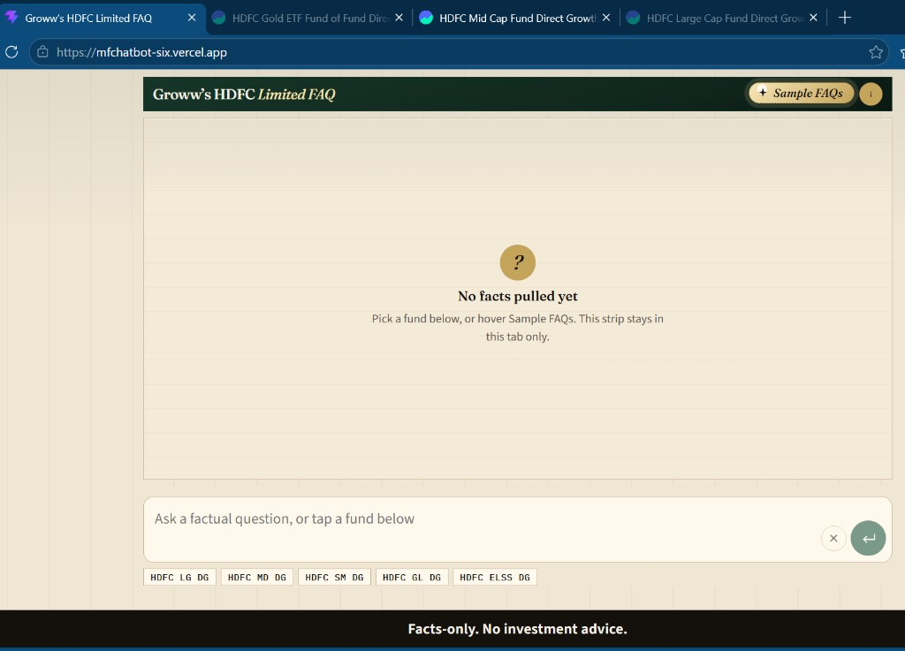
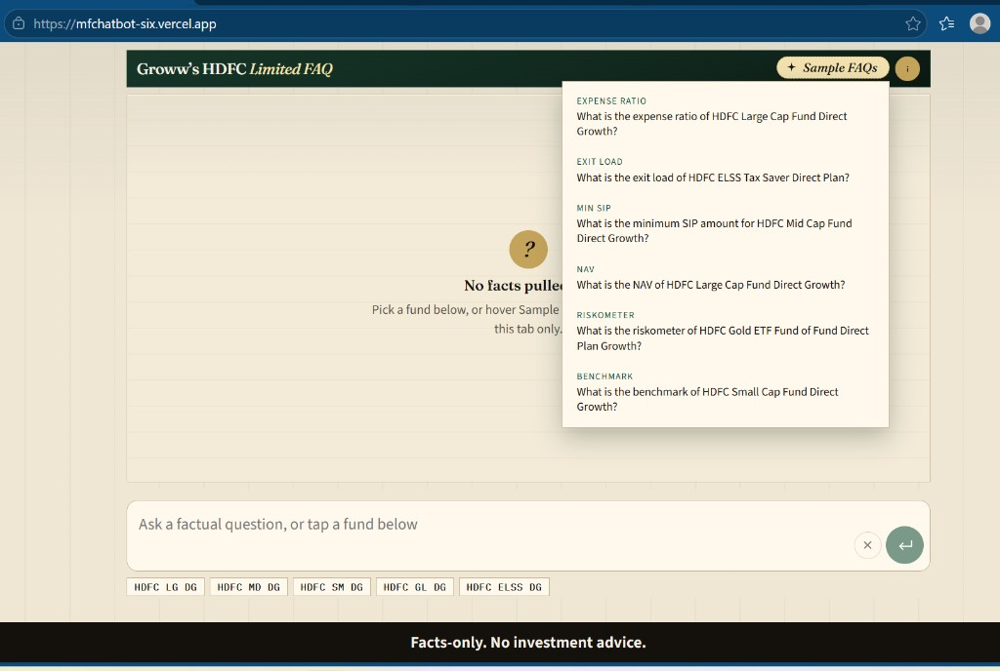
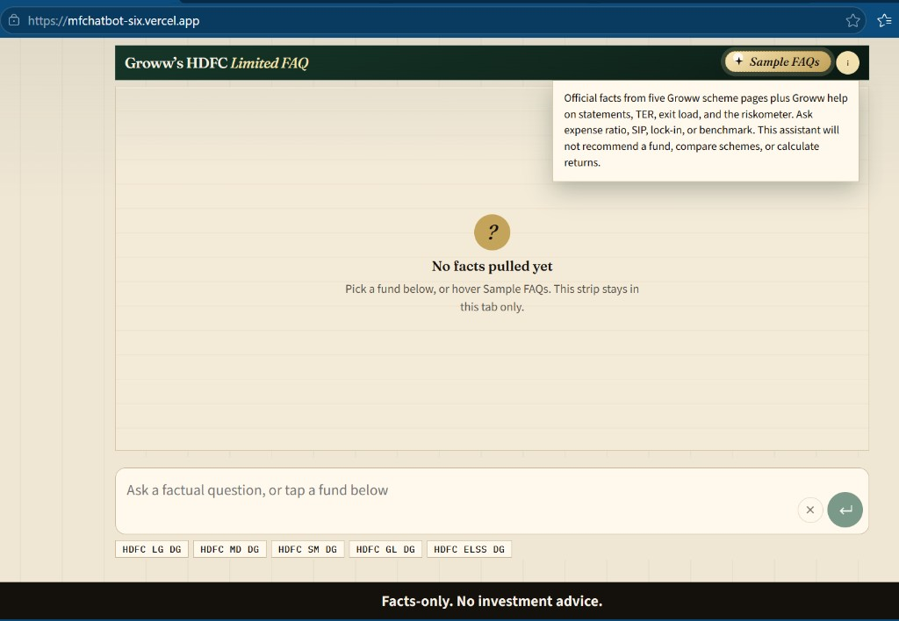
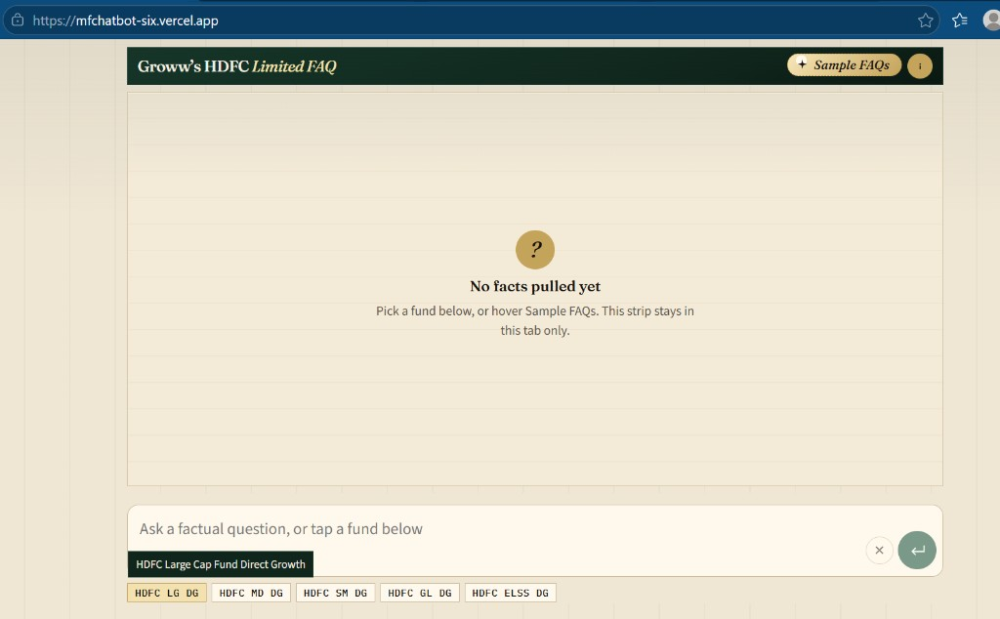
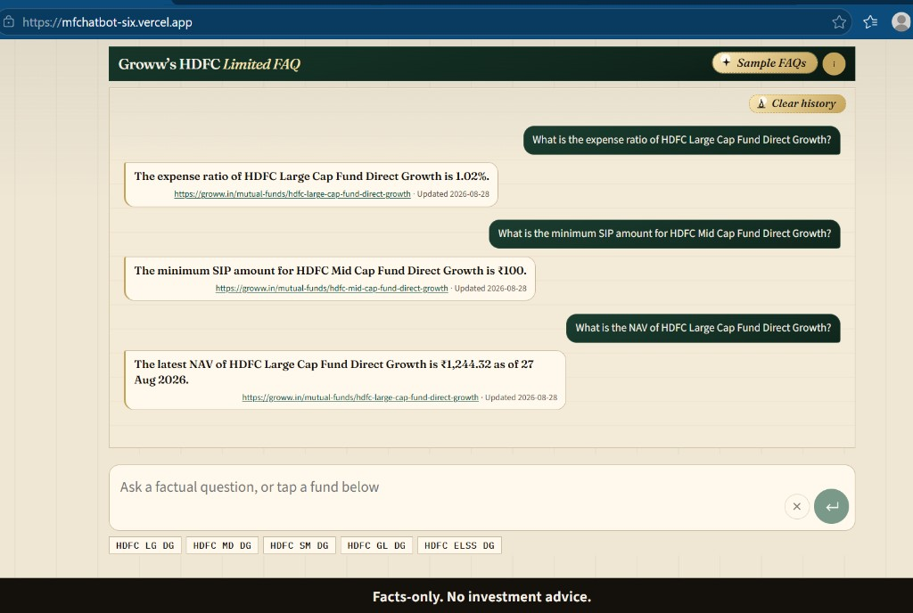

# Groww HDFC FAQ assistant

Facts-only Q&A for five HDFC Direct Growth schemes listed on **Groww**. The assistant retrieves from a curated Groww corpus, answers in at most three sentences, cites one Groww URL, and refuses advice, comparisons, return calculations, and personal identifiers.

**Disclaimer (same snippet as the UI footer):**

> **Facts-only. No investment advice.**

---

## Working prototype

| What | URL |
| --- | --- |
| **Chat app (use this)** | https://mfchatbot-six.vercel.app |
| API health | https://mfchatbot-production-fd5b.up.railway.app/health |
| Source code | https://github.com/manisdevs-git/mfchatbot |
| Screenshot gallery | [chatdemo/preview.html](chatdemo/preview.html) |

Open the chat app. No account, no notebook, no install. History stays in that browser tab only.

Screenshots live in [`chatdemo/`](chatdemo/). If they do not show in this preview, open [chatdemo/preview.html](chatdemo/preview.html) in a browser.

**Home** — empty strip, fund chips, disclaimer.



**Sample FAQs** — hover or click for ready questions (expense ratio, exit load, SIP, NAV, riskometer, benchmark).



**About** — facts-only scope; no recommendations, comparisons, or return math.



**Fund chip** — tap a scheme (tooltip shows the full Groww title).



**Chat** — sourced answers with a Groww URL and last-updated date.



---

## For users

### What you can ask

Factual questions about these five schemes on Groww:

- Expense ratio
- Exit load
- Minimum SIP
- NAV
- Riskometer
- Benchmark
- ELSS lock-in (Tax Saver only)
- How Groww describes downloading statements / ELSS tax reports / CAS

You can also ask for a **table of one fact across all five schemes** (for example exit loads of all schemes).

### What it will not do

- Recommend a fund, say which is better, or tell you to invest
- Calculate or quote returns / CAGR
- Answer other AMCs or schemes that are not in this list
- Use PAN, Aadhaar, phone, email, OTP, or account numbers (it refuses and does not keep that text)

### How to use the live app

1. Open https://mfchatbot-six.vercel.app
2. Read the footer: **Facts-only. No investment advice.**
3. Pick a path:
   - Hover **Sample FAQs** and click a ready question, or
   - Tap a fund chip (`HDFC LG DG`, `HDFC MD DG`, …) then tap a topic (Expense ratio, Exit load, Min SIP, NAV, Riskometer, Benchmark)
4. Or type your own question and press **Enter** (large green button)
5. Wait for the answer bubble. The Groww URL and “Updated …” line sit under the answer
6. **Stop** (smaller red button) cancels a request in flight
7. **Clear history** wipes this tab’s transcript. Refresh also clears it. Nothing is saved on a server

If a question is out of scope, you get a short “not on these Groww pages” note. If it is advice or a comparison (including “which is best”), you get the facts-only refusal plus the two AMFI links in the sample table — not a ranking.

---

## Scope

**Product / corpus host:** Groww (`groww.in` only).  
**AMC on those pages:** HDFC Mutual Fund.  
**Plans:** Direct Growth (five schemes).

| Scheme | Category | Groww page |
| --- | --- | --- |
| HDFC Large Cap Fund Direct Growth | Large-cap | https://groww.in/mutual-funds/hdfc-large-cap-fund-direct-growth |
| HDFC Mid Cap Fund Direct Growth | Mid-cap | https://groww.in/mutual-funds/hdfc-mid-cap-fund-direct-growth |
| HDFC Small Cap Fund Direct Growth | Small-cap | https://groww.in/mutual-funds/hdfc-small-cap-fund-direct-growth |
| HDFC Gold ETF Fund of Fund Direct Plan Growth | Gold / FoF | https://groww.in/mutual-funds/hdfc-gold-etf-fund-of-fund-direct-plan-growth |
| HDFC ELSS Tax Saver Fund Direct Plan Growth | ELSS | https://groww.in/mutual-funds/hdfc-elss-tax-saver-fund-direct-plan-growth |

Process and education pages (also indexed): Groww help for capital-gains / CAS / ELSS tax statement, and Groww primers for expense ratio, exit load, and riskometer.

**Not in scope:** hdfcfund.com, AMFI/SEBI as live sources, Moneycontrol, Value Research, other AMCs, regular plans, IDCW, live web search at answer time.

Canonical list: [`corpus_manifest.json`](corpus_manifest.json). Spreadsheet of 24 URLs: [`docs/sources.csv`](docs/sources.csv).

---

## Source list (24 URLs)

**Indexed in RAG (11)** — these are the only pages the assistant may cite as facts:

| URL | Use |
| --- | --- |
| https://groww.in/mutual-funds/hdfc-large-cap-fund-direct-growth | Scheme facts |
| https://groww.in/mutual-funds/hdfc-mid-cap-fund-direct-growth | Scheme facts |
| https://groww.in/mutual-funds/hdfc-small-cap-fund-direct-growth | Scheme facts |
| https://groww.in/mutual-funds/hdfc-gold-etf-fund-of-fund-direct-plan-growth | Scheme facts |
| https://groww.in/mutual-funds/hdfc-elss-tax-saver-fund-direct-plan-growth | Scheme facts |
| https://groww.in/help/mutual-funds/mf-others/how-to-download-capital-gain-report--50 | Help — capital gain report |
| https://groww.in/help/mutual-funds/mf-track-and-switch/what-is-cas--why-is-it-needed--99 | Help — CAS |
| https://groww.in/help/mutual-funds/order/how-to-download-tax-statement--for-elss--77 | Help — ELSS tax statement |
| https://groww.in/p/expense-ratio | Primer — TER |
| https://groww.in/p/exit-load-in-mutual-funds | Primer — exit load |
| https://groww.in/p/riskometer | Primer — riskometer |

**AMFI education (not in the RAG index)** — attached on advisory / compare refusals only:

| URL | Use |
| --- | --- |
| https://www.amfiindia.com/investor | AMFI investor education hub |
| https://www.amfiindia.com/investor-corner/knowledge-center/risks-in-mutual-funds.html | AMFI — risks in mutual funds |

**Linked from those Groww pages, not in the index (11)** — seen during ingest; the model does not retrieve them:

| URL | Use |
| --- | --- |
| https://groww.in/p/nav | Linked primer |
| https://groww.in/p/sip-systematic-investment-plan | Linked primer |
| https://groww.in/p/benchmark | Linked primer |
| https://groww.in/p/lump-sum | Linked primer |
| https://groww.in/p/asset-under-management | Linked primer |
| https://groww.in/p/mutual-fund-units | Linked primer |
| https://groww.in/p/sebi-securities-and-exchange-board-of-india | Linked from riskometer primer |
| https://groww.in/mutual-funds | Groww MF hub |
| https://groww.in/mutual-funds/amc/hdfc-mutual-funds | Groww HDFC AMC page |
| https://groww.in/mutual-funds/category | Category listing |
| https://groww.in/help | Help hub |

CSV: [`docs/sources.csv`](docs/sources.csv).

---

## Sample Q&A

Full file with ten queries, answers, and links: [`docs/sample-qa.md`](docs/sample-qa.md).

| # | Question | Expected |
| --- | --- | --- |
| 1 | What is the expense ratio of HDFC Large Cap Fund Direct Growth? | 1.02% + Large Cap Groww URL |
| 2 | What is the exit load of HDFC ELSS Tax Saver Direct Plan? | Nil + ELSS Groww URL |
| 3 | What is the minimum SIP amount for HDFC Mid Cap Fund Direct Growth? | ₹100 + Mid Cap Groww URL |
| 4 | What is the lock-in of HDFC ELSS Tax Saver Direct Plan? | 3 years + ELSS Groww URL |
| 5 | What is the riskometer of HDFC Gold ETF Fund of Fund Direct Plan Growth? | High + Gold FoF Groww URL |
| 6 | What is the benchmark of HDFC Small Cap Fund Direct Growth? | BSE 250 SmallCap TRI + Small Cap URL |
| 7 | What is the NAV of HDFC Large Cap Fund Direct Growth? | ₹1244.32 as of 27-Aug-2026 + Large Cap URL |
| 8 | How do I download an ELSS tax statement? | Groww Reports steps + ELSS help URL |
| 9 | Should I invest in this fund? | Refusal + https://www.amfiindia.com/investor and https://www.amfiindia.com/investor-corner/knowledge-center/risks-in-mutual-funds.html |
| 10 | Which fund is better? / which is best scheme | Same refusal + the same two AMFI links |

Figures are from the corpus snapshot dated **2026-08-28**. After a corpus refresh they can change; the citation URL stays the Groww page.

---

## Disclaimer snippet (UI)

The chat footer always shows:

```text
Facts-only. No investment advice.
```

Constant: `DISCLAIMER` in [`web/src/ask.ts`](web/src/ask.ts).

---

## How it works (technical)

Two processes. The browser never holds the Gemini key or the vector index.

```text
You → Vercel (Vite + React chat)
         POST /v1/ask
       → Railway FastAPI
         1. Label scheme + topic for retrieve (src/guard.py) — not an advice phrase list
         2. Search MiniLM + Chroma on Groww chunks
         3. Code refuses PII, return math, listed OOS, incomplete; advice/compare is the system prompt
         4. gemini-3.5-flash-lite writes ≤ 3 sentences from chunks, or the AMFI refusal for advice
         5. Formatter attaches one Groww Source URL + last-updated date (AMFI URLs on advice refusals)
       → JSON to the UI
```

- **Ingest (offline):** scrape `corpus_manifest.json` URLs → normalize → chunk → `all-MiniLM-L6-v2` embeddings → `data/processed/*.jsonl`. Railway boots Chroma from `embeddings.jsonl`.
- **Citations:** the model must not invent a URL. `src/format.py` attaches the winning chunk’s Groww link.
- **Privacy:** PAN-shaped tokens and similar identifiers are refused, not logged as the raw query, and not sent to Gemini. Chat history is tab memory only.
- **Catalog:** “exit loads of all schemes” returns a markdown table (one row per in-scope scheme), not a three-sentence cap. Ranking (“compare all”, “which is best”) is refused with AMFI links, not a table.

More detail: [`@data/Architecture.md`](@data/Architecture.md).

---

## Local setup

You need **Python 3.12**, **Node 20+**, and a **Gemini API key** for generated answers (extractive fallback still works without it for some tests).

### 1. Clone and Python env

```bash
git clone https://github.com/manisdevs-git/mfchatbot.git
cd mfchatbot
python -m venv .venv
# Windows: .venv\Scripts\activate
# macOS/Linux: source .venv/bin/activate
pip install -r requirements.txt
```

### 2. Backend env

Copy [`.env.example`](.env.example) to `.env` in the repo root:

```text
GEMINI_API_KEY=your_key
FRONTEND_ORIGINS=http://127.0.0.1:5173,http://localhost:5173
SCHEDULER_BACKEND=local
```

Never commit `.env`. Never put `GEMINI_API_KEY` in `web/` or Vercel.

### 3. Corpus (already in git)

Processed chunks and embeddings ship in `data/processed/`. To rebuild from Groww:

```bash
python -m ingest.refresh_corpus
```

That fetches only `groww.in` URLs from the manifest, then chunks, embeds, and smoke-searches before replacing live files.

### 4. API

```bash
uvicorn api.main:app --reload --port 8011
```

Check: `GET http://127.0.0.1:8011/health` should show `"ok": true` and `"index_ready": true` (first boot may download MiniLM and build `data/index/`).

Ask:

```bash
curl -s http://127.0.0.1:8011/v1/ask -H "Content-Type: application/json" -d "{\"query\":\"What is the expense ratio of HDFC Large Cap Fund Direct Growth?\"}"
```

Debug without HTTP: `python -m src.pipeline "What is the exit load of HDFC Large Cap Fund Direct Growth?"`

### 5. Chat UI

```bash
cd web
cp .env.example .env
# Production builds use VITE_API_BASE_URL. Local `npm run dev` proxies /v1 to port 8011.
npm install
npm run dev
```

Open http://127.0.0.1:5173. Confirm the disclaimer, Sample FAQs, and one sourced answer. Advice questions (including “say me a best scheme”) should show the two AMFI links, not a Groww ranking.

### 6. Tests

From the repo root, with the venv active:

```bash
python -m unittest discover -s tests -v
```

---

## Production deploy

| Layer | Host | Root | Notes |
| --- | --- | --- | --- |
| API | Railway | repo (`Dockerfile`) | `uvicorn api.main:app --host 0.0.0.0 --port $PORT`. Env: `GEMINI_API_KEY`, `FRONTEND_ORIGINS` (include `https://mfchatbot-six.vercel.app`). Healthcheck: `GET /health`. |
| UI | Vercel | `web/` | Build: `npm run build`. Env: `VITE_API_BASE_URL=https://<railway-host>` (no trailing slash, no Gemini key). |

Need enough RAM for MiniLM + Chroma. CORS allowlists the Vercel origin; a preview URL missing from `FRONTEND_ORIGINS` fails in the browser even if `curl` to Railway works.

Optional operator pages (not linked from chat): `/scheduler` (corpus refresh times), `/latency` (layer timings).

---

## Known limits

- Only the five Groww scheme pages plus the listed Groww help / primers. Other funds are out of scope.
- Answers can be stale until ingest runs again (in-app scheduler, GitHub Action, or `python -m ingest.refresh_corpus`). The footer date is the document `as_of_date`, not “today”.
- Groww HTML mixes facts with returns and “similar funds”; ingest keeps TER, load, SIP, lock-in, riskometer, benchmark, NAV — not rank tables.
- No return math and no “best fund”. Performance questions get the scheme’s Groww page, not a CAGR.
- No login, no portfolio, no downloading statements on your behalf.
- Gemini can rephrase a number; formatter + extractive fallback exist so a missing or non-Groww citation does not ship.
- Gemini’s training data is not a source. Scheme facts come only from ingested Groww pages.
- First API boot can be slow (`index_ready` / MiniLM warmup). `/v1/ask` returns `503` until the index is ready.
- Railway disk is ephemeral unless a volume is attached; scheduler JSON can reset on deploy.
- Chat history is not stored on the server. Close the tab and it is gone.

---

## Project map

| Path | Role |
| --- | --- |
| `api/main.py` | FastAPI: `/health`, `/v1/ask`, scheduler, latency |
| `src/` | Guard, retrieve, generate, format, refuse, pipeline |
| `ingest/` | Fetch Groww pages, chunk, embed, refresh |
| `data/processed/` | Text, chunks, embeddings checked into git |
| `web/` | Vite + React chat |
| `docs/sources.csv` | Source URL list |
| `docs/sample-qa.md` | Sample questions and answers |
| `chatdemo/` | UI screenshots used in this README |
| `@data/Architecture.md` | Design |
| `@data/ProblemStatement.md` | Brief |
| `@data/Evaluation.md` | Eval cases |

---

## License / use

This is a facts-only FAQ prototype for a limited Groww corpus. It is not an investment advisor, not affiliated with Groww or HDFC AMC, and not a substitute for scheme documents or a registered advisor.
